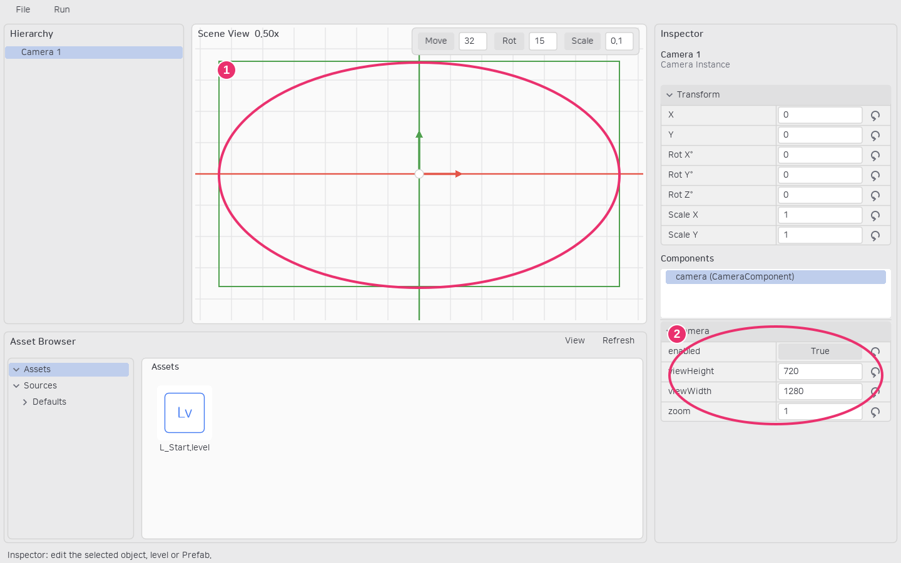

# 카메라와 화면 UI

## Main Camera

빈 곳을 클릭해 레벨 Details를 열고 Camera 그룹의 Main Camera 스포이드를 누릅니다. Hierarchy 또는 뷰포트에서 CameraComponent를 가진 인스턴스를 클릭합니다. 해당 인스턴스에 카메라가 여러 개라면 컴포넌트 이름 메뉴에서 선택합니다. 선택한 인스턴스 ID와 컴포넌트 이름은 레벨 파일에 저장됩니다.


찾기 버튼은 해당 인스턴스를 프레이밍하고, 리셋은 **Auto**로 돌아갑니다. 지정한 카메라가 비활성·제거되면 첫 번째 enabled 카메라를 사용합니다. 카메라가 없으면 원점·배율 1로 실행합니다. 런타임 코드의 `world:setActiveCamera(camera)`는 저장된 기본 지정 이후 카메라를 전환할 수 있습니다.

## 카메라 크기와 방향

카메라 인스턴스를 선택하고 컴포넌트 계층의 camera를 클릭합니다. viewWidth/viewHeight는 기준 월드 범위이고 zoom이 클수록 보이는 범위는 줄어듭니다. 화면 비율이 다르면 기준 범위를 유지하고 여백을 둡니다. Scene View 외곽선은 해당 카메라의 기준 가시 영역입니다.



①은 카메라 가시 영역, ②는 선택한 CameraComponent의 크기·zoom 설정입니다.

위치는 전체 부모 Transform을 합성합니다. 방향은 카메라와 조상의 **Z 회전만 합산**하며 X/Y 기울기와 스케일은 카메라 방향·확대율에 적용하지 않습니다. 확대는 zoom으로 설정합니다. 카메라는 화면 Canvas 아래가 아닌 월드의 일반 오브젝트로 구성합니다.

## 화면 Canvas와 사각형 영역

CanvasComponent는 화면 좌표계의 루트입니다. 화면 중심이 (0, 0), 오른쪽·아래가 양수이며 1단위는 1픽셀입니다. matchViewport가 켜져 있으면 현재 뷰포트 전체 크기, 꺼져 있으면 width/height를 사용합니다. Canvas 위 조상의 월드 변환과 게임 카메라 이동은 UI에 적용하지 않습니다.

```lua
local Engine = require("Engine")
local Hud = {}
function Hud.build(self)
    self:setRootComponent("canvas", Engine.CanvasComponent)
    local panel = self:addComponent("panel", Engine.RectComponent, {width = 300, height = 100})
    panel:addComponent("sprite", Engine.SpriteComponent, {fillParent = true})
    panel:addComponent("pointer", ClickableClassId, {boundsSource = "sprite"})
end
```

RectComponent는 배경을 그리지 않는 영역입니다. 그림이 필요하면 Sprite를 붙이고, 클릭이 필요하면 PointerComponent를 붙입니다. fillParent는 가장 가까운 Bounds 조상의 영역을 사용하며 Sprite도 그 크기로 맞춥니다. 정확히 채울 때는 자식 Transform을 기본값으로 둡니다. 현재 앵커·레이아웃 자동 배치·자식 클리핑은 제공하지 않습니다.

```text
상속: SceneComponent
      ├─ CameraComponent
      └─ BoundsComponent
         ├─ RectComponent → CanvasComponent
         ├─ RenderComponent → SpriteComponent
         └─ PointerComponent

부착: Canvas → Panel(RectComponent) → Sprite / Pointer
참조: Pointer.boundsSource → 같은 오브젝트의 Sprite 영역
```

## 표시와 입력 순서

sortingOrder가 큰 렌더러가 앞에 표시됩니다. inputPriority가 큰 Pointer가 먼저 입력을 받으며 기본 0에서는 참조 렌더러의 표시 순서를 따릅니다. Canvas UI는 월드보다 앞에 표시되고 우선 입력을 받습니다.

Pointer의 onPointerDown/up/move가 true를 반환하거나 blockPointer가 켜져 있으면 뒤쪽으로 전달하지 않습니다. 소비한 down 이후에는 영역 밖의 move/up도 캡처 대상에 전달됩니다. 여러 버튼을 동시에 눌러도 각 release를 처리합니다. 포커스 상실·Play 종료·입력 오류는 캡처를 해제합니다.
