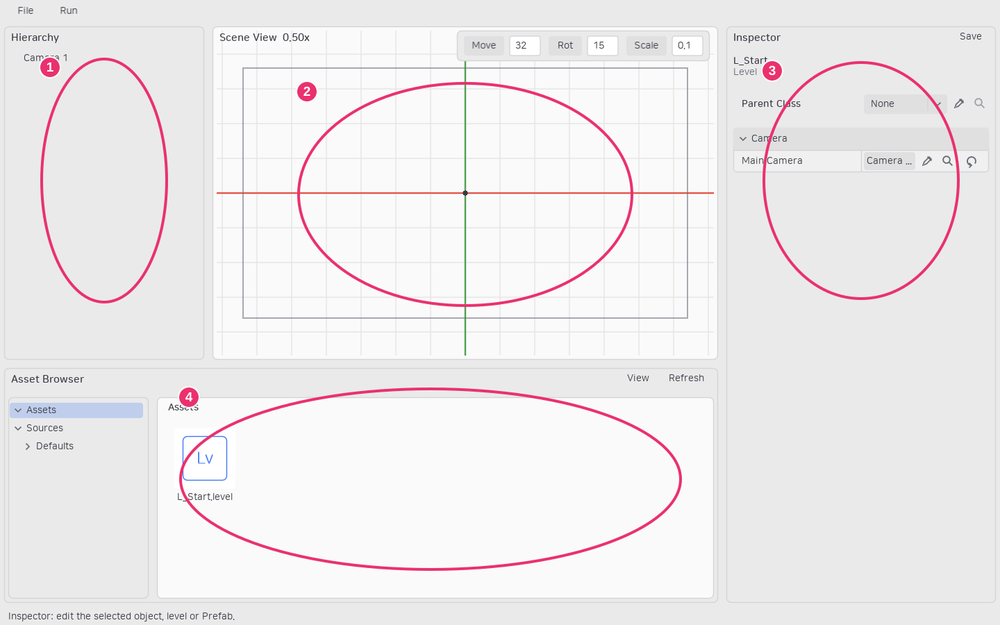

# 에디터 화면과 선택

| 영역 | 역할 |
|---|---|
| Hierarchy | 레벨의 오브젝트 계층, 다중 선택·부모 변경 |
| Scene View | 배치·변환·카메라 범위 확인 |
| Inspector | 선택한 에셋·인스턴스·현재 레벨의 설정 |
| Asset Browser | Assets/Sources 폴더와 파일 탐색·생성·이동 |

## 선택과 참조 지정

인스턴스를 선택하면 해당 인스턴스 Inspector가 열립니다. 에셋을 선택하면 해당 에셋 정보가 열립니다. **뷰포트나 Hierarchy의 빈 곳을 클릭하면 오브젝트 선택을 해제하고 현재 레벨 Details를 표시합니다.** 레벨에서는 Parent Class, Main Camera와 레벨 클래스의 선언 프로퍼티를 편집합니다.

Inspector의 이미지·생성 템플릿·Parent Class·Main Camera 참조는 **스포이드**로 지정합니다. 스포이드 중에는 십자 커서가 표시되고 후보를 클릭해도 Inspector 대상은 바뀌지 않습니다. Esc 또는 우클릭으로 취소합니다. 찾기 버튼은 에셋을 잠시 강조하거나 인스턴스를 뷰포트에서 프레이밍합니다.

일반 에셋 드래그는 파일 이동이나 인스턴스 배치에 사용합니다. Inspector 필드에는 에셋을 드롭하지 않습니다. Prefab 계층에 자식을 넣을 때는 계층 우클릭의 **Add Child → Pick Source...**를 사용합니다.

## Inspector와 스크롤

Prefab Inspector에는 오브젝트 계층, Parent Class, 오브젝트 프로퍼티, 컴포넌트 계층, 선택한 컴포넌트 프로퍼티가 표시됩니다. 인스턴스의 Parent Class는 바꿀 수 없습니다. 각 프로퍼티 그룹의 화살표로 내용을 접고 펼칩니다.

Inspector 제목과 Save는 고정되며 아래 내용 전체가 스크롤됩니다. 내부 오브젝트·컴포넌트 계층은 자체 스크롤을 우선 사용합니다. 모두 보이거나 해당 방향의 끝이면 휠이 Inspector 전체 스크롤로 이어집니다. 두 내부 계층은 3행 높이로 시작하며 하단 손잡이로 크기를 조절합니다.

숫자 필드는 클릭해 입력하거나 좌우 드래그로 증감합니다. 드래그 중에는 커서와 입력 caret이 숨겨지고 테두리가 강조됩니다. 문자열은 커서 이동·문자 선택·선택 영역 대체 입력을 지원합니다.

## 주요 단축키

| 단축키 | 동작 |
|---|---|
| W / E / R | 이동 / 회전 / 스케일 기즈모 |
| F | 선택 프레이밍 |
| Ctrl+D | 선택 복제 |
| Delete | 선택 삭제 |
| Ctrl+Z / Ctrl+Shift+Z | Undo / Redo |
| Ctrl+S | 현재 문서 저장 |
| Ctrl+Shift+S | 변경 문서 목록에서 체크한 대상 저장 |
| F5 | Play / Stop |

Move·Rot·Scale 버튼은 각 스냅을 켜고 끕니다. 숫자는 각각 독립적으로 저장됩니다. 스냅은 드래그 시작 값 기준으로 적용되므로 이동값 20에서 단위 100이면 120 또는 -80으로 이동합니다. 텍스트 편집 중에는 뷰포트 단축키를 처리하지 않습니다.
