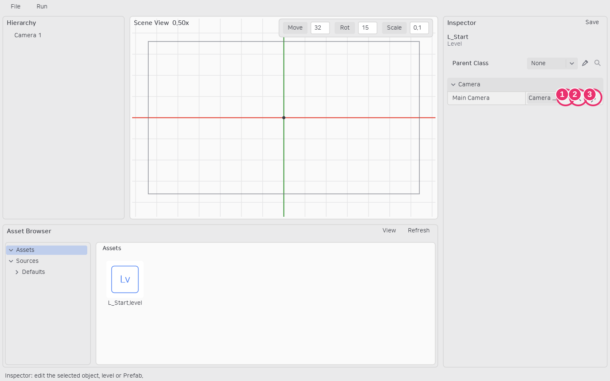
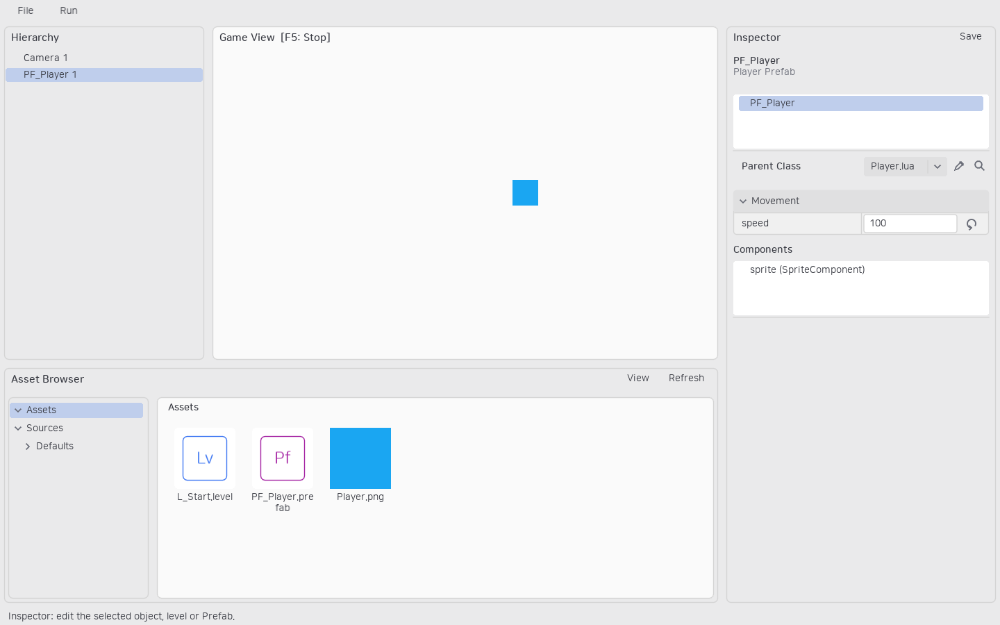

# 첫 프로젝트와 실행

## 실행 준비

소스에서 실행하려면 LÖVE 11.5를 설치하고 저장소 루트에서 `love src`를 실행합니다. Windows 배포물을 만들 때는 PowerShell에서 다음 명령을 사용합니다.

```powershell
./scripts/packageEditor.ps1 -verify
```

생성된 `build/windows/Labo.exe`는 에디터, `Labo-cli.exe`는 자동화용 콘솔 실행 파일입니다. 배포 폴더의 LÖVE DLL과 리소스는 실행 파일과 함께 유지합니다. 자세한 조건은 [패키징 안내](../packaging.md)를 참고하세요.

## 프로젝트와 첫 레벨

1. 시작 화면에서 New Project를 선택하고 부모 폴더와 프로젝트 이름을 입력합니다.
2. 프로젝트의 `Assets`와 `Sources`가 생성됩니다. 새 프로젝트에는 AI 지침 `AGENTS.md`와 로컬 핵심 안내도 포함됩니다.
3. **File → New → Level**을 선택합니다. 부모 Level 클래스를 선택하거나 기본 Level을 사용하고 Next로 넘어갑니다.
4. 폴더를 선택하고 `L_` 뒤에 이름을 입력합니다. 에셋 브라우저의 폴더에서 생성했다면 해당 폴더가 기본 위치입니다.
5. 생성한 레벨을 에셋 브라우저에서 더블클릭해 엽니다.

새 레벨에는 `Camera 1`이 생성되며 레벨의 Main Camera로 지정됩니다. 기본 위치·회전은 0, 기준 크기는 1280×720, zoom은 1입니다. 생성되는 `Sources/Defaults/Camera.lua`는 일반 LObject 클래스이며 코드로 CameraComponent를 루트에 붙입니다. 기존 레벨을 열 때는 카메라를 자동 추가하지 않습니다.



## 첫 오브젝트

**File → New → Class**에서 LObject를 부모로 선택하고 `Player` 클래스를 만듭니다. 클래스 파일은 `Sources/Player.lua`에 있습니다. 아래처럼 루트에 SpriteComponent를 부착합니다.

```lua
-- labo-script: lobject
local Engine = require("Engine")
local Player = {}
function Player.build(self)
    self:setRootComponent("sprite", Engine.SpriteComponent)
end
return Player
```

Class를 부모로 한 `PF_Player` Prefab을 만들고 Inspector에서 `sprite`를 선택합니다. image 옆 스포이드를 누른 다음 에셋 브라우저의 PNG 이미지를 고릅니다. Prefab을 저장한 뒤 에셋 브라우저에서 뷰포트 또는 계층으로 드래그하면 인스턴스가 생성됩니다.

F5 또는 **Run → Play**로 실행하고 다시 F5 또는 Stop으로 편집에 돌아옵니다. Play에서 바뀐 런타임 값은 편집 중인 레벨에 기록되지 않습니다.


