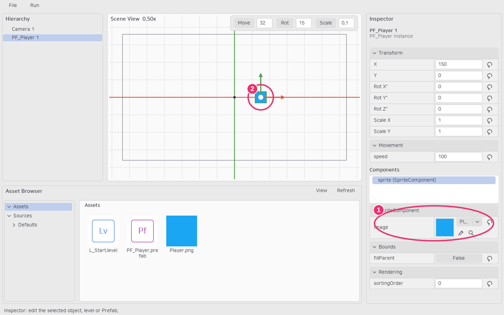
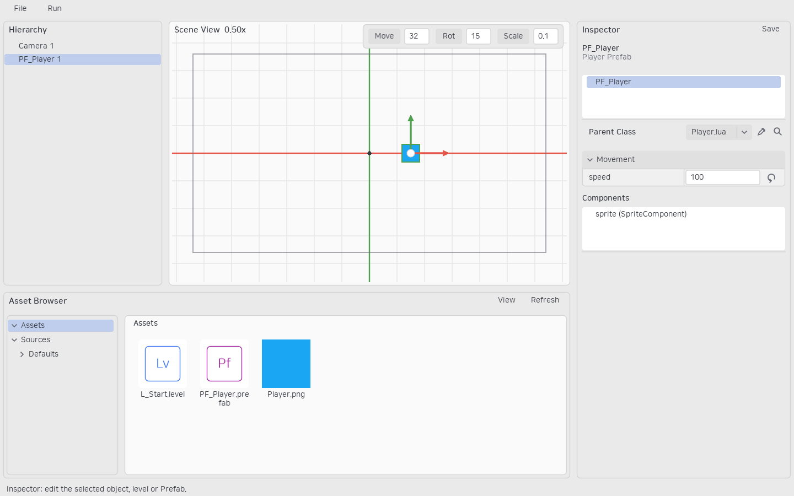

# 클래스와 Prefab

Lua Class는 코드와 기본 프로퍼티·컴포넌트 구성을 선언합니다. Prefab은 그 클래스 또는 다른 Prefab을 부모로 삼고 값과 오브젝트 계층을 저장합니다. 인스턴스는 레벨에 배치된 별도 객체이며 개별 override를 갖습니다.

## 선언 프로퍼티

```lua
local Player = {properties = {
    speed = {type = "number", default = 100, group = "Movement"},
    title = {type = "string", default = "Player"},
    enabled = {type = "boolean", default = true},
    target = {type = "object", default = false},
    projectile = {type = "lobjectTemplate", default = false}
}}
```

properties에 선언한 필드는 Inspector에서 편집합니다. 일반 Lua 필드는 자동으로 노출되지 않습니다. group을 생략하면 클래스 이름 그룹을 사용합니다. object는 같은 계층의 인스턴스 참조, lobjectTemplate은 생성할 LObject Class 또는 Prefab 참조입니다.

## 컴포넌트 구성

컴포넌트는 코드의 build에서 부착합니다. build는 에디터에서도 실행되므로 게임 입력·시간 진행은 beginPlay/update에 둡니다. LObjectComponent는 생명주기, SceneComponent는 Transform, BoundsComponent는 영역을 제공합니다.

```lua
function Player.build(self)
    local mount = self:addComponent("mount", Engine.SceneComponent, {x = 20})
    mount:addComponent("sprite", Engine.SpriteComponent)
end
```

루트 Transform이 곧 인스턴스 Transform입니다. 자손은 부모의 위치·회전·스케일을 상속합니다. Prefab 루트 Transform은 Inspector에서 편집하지 않고 배치 인스턴스의 Transform으로 설정합니다.



①은 image 참조와 스포이드·찾기 버튼, ②는 실제 배치된 Sprite입니다.

## 계층 Prefab

Hierarchy에서 오브젝트를 우클릭해 **Create Prefab...**을 사용하면 선택 루트와 자손을 함께 저장합니다. Prefab Inspector의 오브젝트 계층에서 자식을 선택해 해당 오브젝트를 편집하고, 컴포넌트 계층에서 컴포넌트를 선택해 그 프로퍼티를 편집합니다.

자식 추가는 계층 우클릭 **Add Child → Pick Source...**로 시작합니다. 에셋의 Class/Prefab 또는 레벨 인스턴스를 고르면 자식으로 추가됩니다. 인스턴스를 복사할 때 현재 유효 값과 계층을 보존합니다. 순환 Prefab 참조와 캡처 범위 밖의 저장할 수 없는 참조는 거절합니다.



레벨 Hierarchy와 Scene View는 드래그 박스 다중 선택, 복제·삭제·이동을 지원합니다. 부모 위에 드롭하면 자식이 되고, 자식을 현재 부모 위에 다시 드롭하면 최상위로 분리됩니다. 상세 상속·내부 참조 계약은 [계층 Prefab](../hierarchy-prefabs.md)을 참고하세요.
